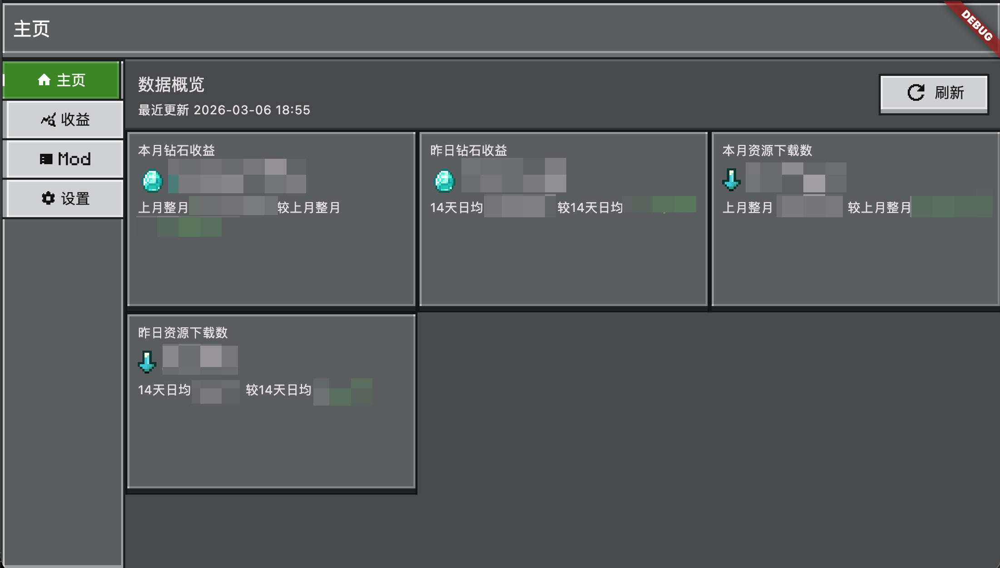

# MC 开发者收益助手（mcdev_income）

面向 MC 开发者平台的收益查看与统计工具，使用 Flutter 构建。通过内置 WebView 登录并读取 Cookie，再调用平台接口获取概览、Mod 列表与收益明细。

## 功能概览
- 数据概览：钻石/下载量等核心指标
- 收益汇总：按时间范围统计并计算分成
- Mod 列表：查看 Mod 状态、价格、销量统计
- 设置中心：主题切换、登录状态、开发者信息

## 截图


## 快速开始
1. 安装 Flutter（确保已配置好开发环境）
2. 获取依赖

```bash
flutter pub get
```

3. 运行

```bash
flutter run
```

## 使用流程
1. 打开“设置”页面，通过 WebView 登录
2. 登录完成后返回刷新状态
3. 在“主页 / 收益汇总 / Mod 列表”查看数据

## 目录结构（核心）
- `lib/main.dart`：应用入口与库声明
- `lib/app/`：应用壳与导航
- `lib/pages/`：页面实现
- `lib/services/`：登录与数据接口
- `lib/models/`：数据模型
- `lib/widgets/`：通用组件

