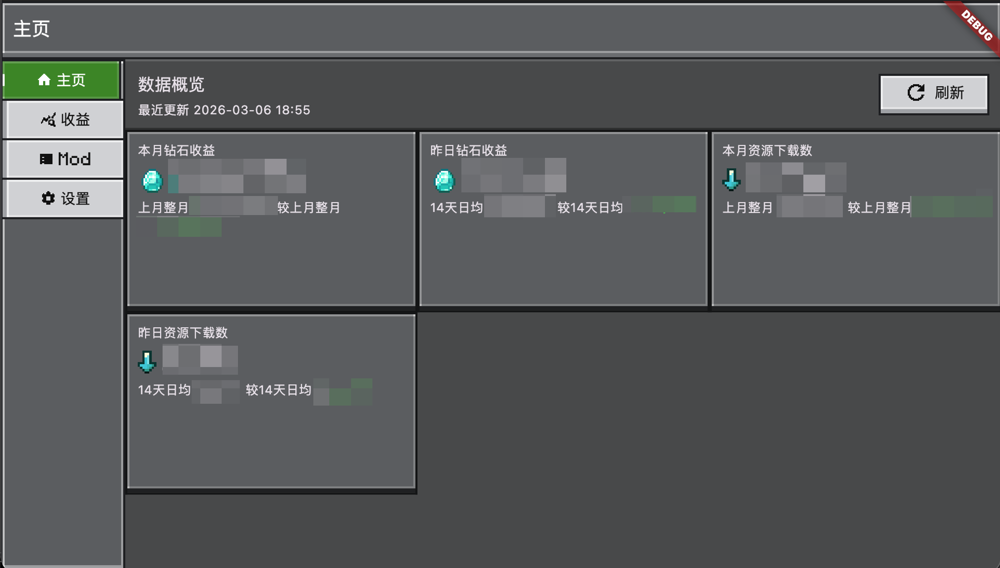

# 我的世界开发者管理

面向 MC 开发者平台的收益查看与作品管理工具，使用 Flutter 和 OreUI 构建。通过原生账号登录维护会话，再调用平台接口获取概览、Mod 列表、收益明细与资源管理数据。

## 功能概览
- 数据概览：钻石/下载量等核心指标
- 首页排行榜：热门飙升、热搜、手游免费/畅销、端游下载/点赞榜，按作品类别筛选与分页
- 站内邮件：顶部右上角入口、未读数量、标题搜索、类型与未读筛选，电脑上并排查看列表和正文
- 收益汇总：按时间范围统计并计算分成
- Mod 列表：查看 Mod 状态、价格、销量统计
- 作品与模组管理：PE / PC 列表搜索、状态筛选、分页、详情、原生表单编辑和本机草稿
- 上传与审核：资源包、展示图片、介绍图片和视频上传；图片支持 OreUI 弹窗裁剪、缩放和旋转，按平台尺寸导出；保存、独立提审、排队确认、审核反馈和撤销
- 发布维护：机审自测、上架、定时上架、改价、弱下架，以及按账号权限开放的加急和 PC 催审
- 作品关联：前置模组、DLC 主副包、PE 同步 PC 编辑
- 设置中心：主题切换、登录状态、开发者信息
- Apple 芯片 Mac 本地开发：可配置数据目录、按需下载 Wine 和最新游戏、导入模组、启动测试；共用已有账号登录，详见 [本地开发说明](docs/development.md)
- 无头命令行：桌面 GUI 可执行文件追加 `--headless` 即可运行命令，支持 JSON 输出、文件路径上传、图片默认裁剪、提审和失败恢复，方便 Agent 调用

## 截图


应用图标取自 [Minecraft 官方 X 账号头像](https://x.com/Minecraft)（2026-09-27），原始图片保存在 [`assets/minecraft_x_avatar.jpg`](assets/minecraft_x_avatar.jpg)。

## 快速开始
OreUI 使用 pub.dev 上的 `oreui_flutter` 版本，包含按钮文字裁切和滚动条修复。

1. 安装 Flutter（确保已配置好开发环境）
2. 获取依赖

```bash
flutter pub get
```

3. 运行

```bash
flutter run
```

## 使用流程
1. 打开“设置”页面，使用开发者账号登录
2. 登录完成后返回刷新状态
3. 在“主页 / 收益汇总 / Mod 列表 / 资源管理”查看和维护数据
4. 在“资源管理”中新建或编辑作品，上传文件并填写介绍，可先保存本机草稿或保存到平台
5. 选择“保存并提交审核”，核对审核备注后确认提交；需要排队时再次确认。平台拒绝提审时，已保存的作品仍可继续编辑或重试提审

当前优先覆盖普通 PE / PC 作品管理。网络游戏保留查看入口，运营、结算、团队和网络服运维后续补齐。接口依据、具体覆盖范围和验证边界见 [作品管理说明](docs/resource_workflow.md)。

## 命令行与 Agent

桌面版构建完成后，直接在 GUI 可执行文件后追加 `--headless` 和命令。例如 macOS：

```sh
"build/macos/Build/Products/Release/我的世界开发者管理.app/Contents/MacOS/我的世界开发者管理" --headless schema
"build/macos/Build/Products/Release/我的世界开发者管理.app/Contents/MacOS/我的世界开发者管理" --headless list
```

Windows 使用发布目录中的 `minecraft_developer_manager.exe`，Linux 使用 `bundle/minecraft_developer_manager`，参数写法相同。CLI 与桌面端共用会话、草稿和预设；发布包仍需带上 Flutter 运行库和资源文件。首次升级后打开桌面端一次会迁移原有状态，也可以用 `auth login --password-stdin` 直接登录。完整参数、清单示例和恢复方法见 [命令行使用说明](docs/cli.md)。

排行榜和邮件的数据来源、阅读状态规则见 [首页与邮件说明](docs/dashboard_mail.md)。

## 目录结构（核心）
- `lib/main.dart`：应用入口与库声明
- `lib/core.dart`：GUI / CLI 共享的纯 Dart 业务核心
- `lib/cli/`：桌面可执行文件的无头命令行与 Agent 输出协议
- `lib/storage/`：桌面共享状态与跨进程锁
- `lib/app/`：应用壳与导航
- `lib/pages/`：页面实现
- `lib/services/`：登录与数据接口
- `lib/models/`：数据模型
- `lib/widgets/`：通用组件
